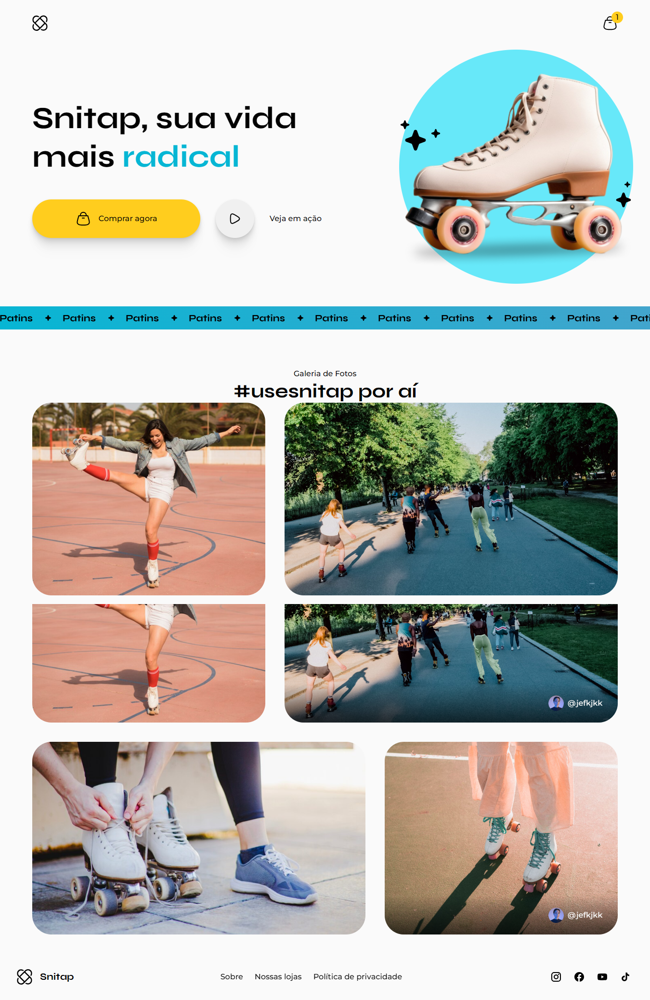

# ⛸ Snitap

Nesta landing page é utilizado conceitos importantes e mais avançados de animações e transições do CSS, sendo utilizadas de maneiras diferentes.

## 📑 Índice

- [Tecnologias Utilizadas](#️-tecnologias-utilizadas)
- [UI](#-ui)
- [Funcionalidades](#️-funcionalidades)
- [Como Rodar o Projeto](#️-como-rodar-o-projeto)
- [Agradecimentos](#️-agradecimentos)

## 🛠️ Tecnologias Utilizadas

### 🔎 Front-end

- **HTML/CSS** - Design do site e responsividade

  

## 📷 UI

### Desktop

## ⚙️ Funcionalidades

- Landing page de um site sobre venda e utilização de patins.

## 🚀 Como Rodar o Projeto

- 🔗 Link - https://jefolidev.github.io/patins-landingpage/

## 👥 Fale comigo!

Achou meu repertório interessante e gostaria de contratar um freela ou talvez me contratar para tornar acrescenter no seu negócio? Entre em contato comigo e vamos marcar.

  
  

